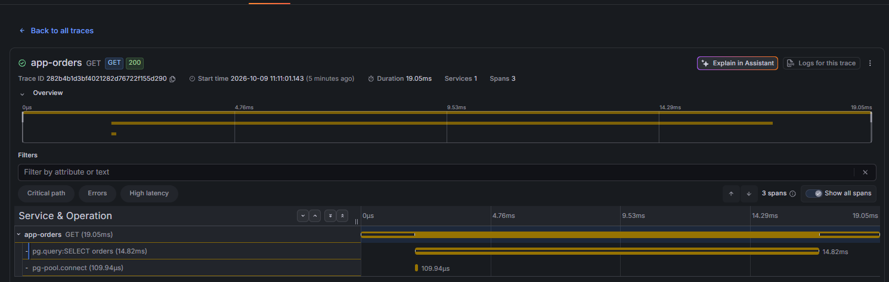
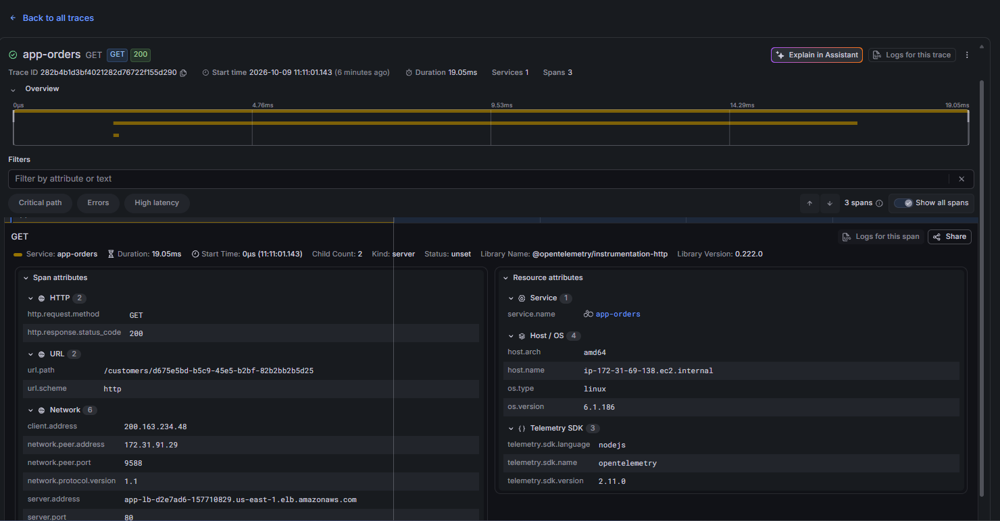
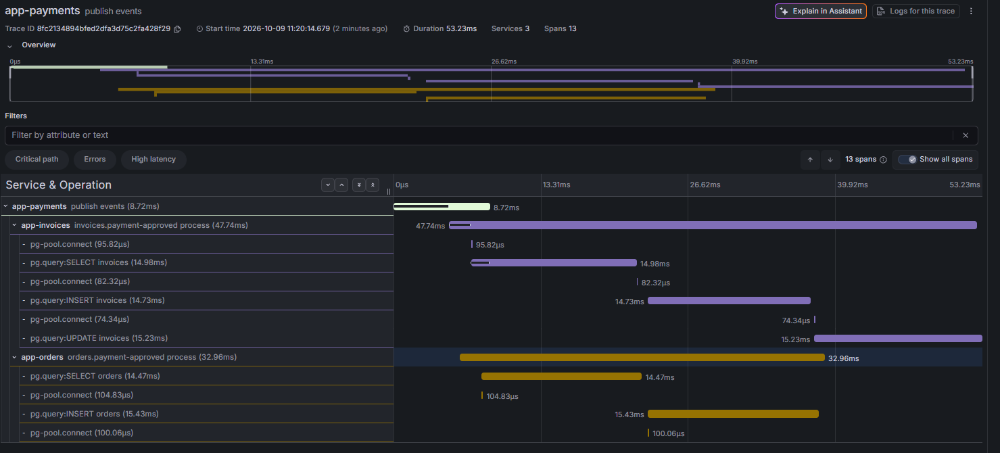
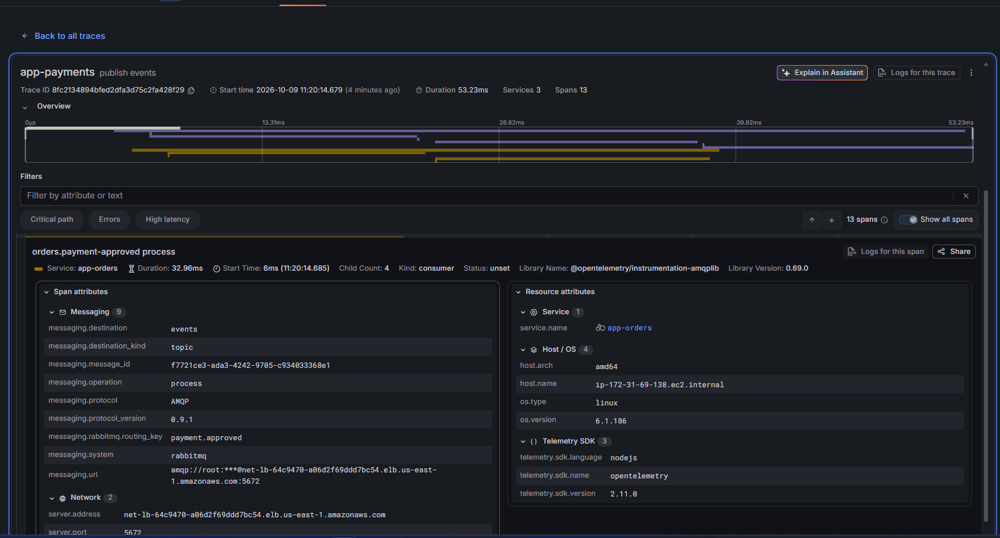

# Testes em produção (AWS)

Roteiro para exercitar a API pelo Kong na AWS e acompanhar os traces da saga no Grafana Cloud. Os exemplos usam [HTTPie](https://httpie.io/cli).

```bash
export BASE_URL=http://app-lb-d2e7ad6-157710829.us-east-1.elb.amazonaws.com
```

O endereço é o DNS do load balancer (`appLoadBalancer` em `infra/src/load-balancer.ts`). Ele muda se a stack for recriada: confira com `pulumi stack output` em `infra/`.

O Kong só roteia `/orders`, `/customers` e `/invoices` (`docker/kong/config.template.yaml`). O `/health` e o Swagger (`/docs`) de cada serviço não passam pelo gateway: `GET /health` responde 404 (`no Route matched`) e `GET /orders/health` responde 400, porque cai em `/orders/:id`.

## 1. Fluxo feliz: pedido pago

```bash
# Cliente (o e-mail é único: troque a cada execução)
http POST $BASE_URL/customers \
  name="John Doe" email="john+$(date +%s)@example.com" \
  address="Rua das Flores, 123" state=PR zipCode=80000-000 country=Brazil \
  dateOfBirth=1990-05-10
# 201 {"customerId":"<uuid>"}
export CUSTOMER_ID=<customerId>

http GET $BASE_URL/customers/$CUSTOMER_ID
# 200 com os dados do cliente

# Pedido (amount em centavos: 10050 = R$ 100,50)
http POST $BASE_URL/orders customerId=$CUSTOMER_ID amount:=10050
# 201 {"orderId":"<uuid>"}
export ORDER_ID=<orderId>

# A saga é assíncrona: espere alguns segundos
http GET $BASE_URL/orders/$ORDER_ID
# 200, status "paid" (ou "canceled" se o pagamento falhou)

http GET "$BASE_URL/invoices?orderId=$ORDER_ID"
# 200, a fatura do pedido com status "paid" (ou "canceled")
```

Se o `PAYMENT_APPROVAL_RATE` do payments for menor que 1, parte dos pedidos é cancelada por `PaymentFailed`. Isso é esperado. Crie outro pedido para ver o caminho contrário.

## 2. Cancelamento pelo cliente

O cancelamento só vale para pedidos `pending`. Como o pagamento costuma sair em menos de 1 s, cancele logo depois de criar:

```bash
http POST $BASE_URL/orders customerId=$CUSTOMER_ID amount:=5000
export ORDER_ID=<orderId>

http POST $BASE_URL/orders/$ORDER_ID/cancel reason="Desisti da compra"
# 200 com o pedido "canceled"; 409 se ele já foi pago
```

## 3. Consultas

```bash
http GET "$BASE_URL/orders?page=1&pageSize=10"
http GET "$BASE_URL/orders?status=paid"
http GET "$BASE_URL/orders?customerId=$CUSTOMER_ID"

http GET "$BASE_URL/invoices?page=1&pageSize=10"
http GET "$BASE_URL/invoices?status=open"
http GET $BASE_URL/invoices/<invoiceId>
```

`status` do pedido: `pending`, `paid`, `canceled`. Da fatura: `open`, `paid`, `canceled`. `pageSize` vai até 100.

## 4. Erros esperados

```bash
http POST $BASE_URL/customers name="X"                              # 400: campos obrigatórios
http POST $BASE_URL/customers <mesmo body de um cliente existente>  # 409: e-mail já cadastrado
http GET $BASE_URL/orders/abc                                       # 400: id não é UUID
http GET $BASE_URL/orders/00000000-0000-4000-8000-000000000000      # 404
http POST $BASE_URL/orders customerId=00000000-0000-4000-8000-000000000000 amount:=100  # 404: cliente inexistente
http POST $BASE_URL/orders customerId=$CUSTOMER_ID amount:=0        # 400: amount precisa ser > 0
http POST $BASE_URL/orders/<id de um pedido pago>/cancel            # 409
```

## 5. Traces no Grafana Cloud

Os serviços exportam por OTLP com estes nomes (`OTEL_SERVICE_NAME` em `infra/src/services/*.ts`): `app-orders`, `app-invoices` e `app-payments`. O Kong não é instrumentado, então o trace começa no serviço.

Os serviços só enviam traces, sem métricas. Por isso a página **Observability** (Services, Databases...) do Grafana fica vazia. Os traces aparecem em **Explore** e em **Drilldown → Traces**.

No **Explore**, escolha a fonte de traces (Tempo, `grafanacloud-<stack>-traces`) e use **TraceQL**:

```traceql
# Requisição HTTP de um pedido específico (o POST /orders grava o atributo order_id)
{ span.order_id = "<ORDER_ID>" }

# Tudo que passou por um serviço
{ resource.service.name = "app-orders" }

# Etapas da saga: cada publicação do relay do outbox abre um trace
{ name = "publish events" }

# Só os erros
{ status = error }
```

Os traces levam alguns segundos para aparecer.

### Requisição HTTP

Uma requisição que passa pelo Kong vira um trace com o span HTTP do Fastify e os spans do Postgres (`pg-pool.connect`, `pg.query`). Abaixo, um `GET /customers/:id` no orders:



Ao clicar no span, aparecem os atributos da requisição (método, `url.path`, status) e do recurso (`service.name`, host e versão do SDK):



### Saga pelo RabbitMQ

O relay do outbox publica os eventos fora da requisição HTTP. Por isso, o `POST /orders` e a saga ficam em traces separados: cada publicação do relay abre um trace `publish events`. A instrumentação do amqplib propaga o contexto na mensagem, e os consumidores dos outros serviços aparecem como filhos desse trace. Para ver a saga de um pedido, procure os traces `publish events` de cada serviço no mesmo minuto do pedido.

Abaixo, o payments publica o `PaymentApproved`, e o invoices (`invoices.payment-approved process`) e o orders (`orders.payment-approved process`) consomem o evento e atualizam a fatura e o pedido no Postgres:



Ao clicar num span consumidor, aparecem os atributos da mensagem: exchange (`messaging.destination`), routing key (`payment.approved`), id da mensagem e o serviço que consumiu:


